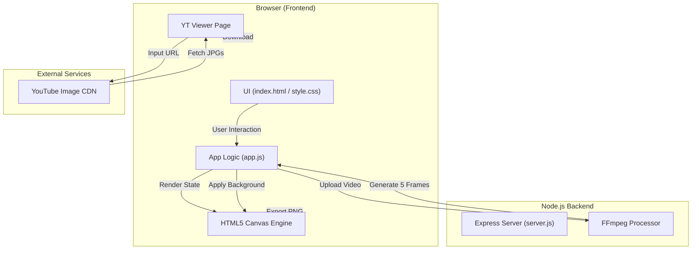

# 🏗️ ThumbCraft Technical Architecture

This document provides a deep dive into the technical workings of **ThumbCraft**, the professional YouTube thumbnail editor and viewer.

## 🗺️ System Overview

The following diagram illustrates how the different parts of the application interact:

## 🧠 Core Engine Details

### 1. The Rendering Loop (`app.js`)
ThumbCraft uses a **State-Based Rendering** model. The entire state of your thumbnail is stored in a simple JavaScript object. Whenever you make a change:
1.  The `redraw()` function is called.
2.  The canvas is cleared (`clearRect`).
3.  The background is drawn (`drawBackground`).
4.  Each element (text, shapes, emojis, images) is iterated through and drawn using the `renderElements()` function.
5.  This ensures that your "layers" are always rendered in the correct order.

### 2. Video Analysis & Frame Extraction
This is the most advanced feature of the editor. When you upload a video:
- **Client-Side Processing:** To save bandwidth, the app uses an invisible `<video>` element in your browser.
- **Scrubbing:** The code calculates 5 specific timestamps (10%, 30%, 50%, 70%, 90%) and "seeks" the video to those points.
- **Snapshotting:** Once the video reaches a seek point, the frame is drawn onto an offscreen canvas and converted to a `Base64` image.
- **User Selection:** These frames are presented to you in a sidebar gallery, allowing you to "analyze" the video and pick the perfect shot.

### 3. State Management (Undo/Redo)
Every significant action (moving text, adding a shape, changing a color) triggers a `saveState()` call.
- The current state of all elements is pushed onto a **History Stack**.
- If you click "Undo", the app pops the last state from the stack and re-renders the canvas.
- This provides a professional-grade editing experience.

### 4. YouTube Thumbnail Viewer
This standalone tool (`youtube-viewer.html`) is a utility that:
- Uses a **Regex Pattern** to parse YouTube URLs and extract the unique 11-character Video ID.
- Directly communicates with YouTube’s public image servers (`img.youtube.com`) to pull official thumbnails.
- Supports direct video links by using the same "Snapshotting" logic mentioned in the Editor section.

## 🛠️ Technology Stack
- **Frontend:** Vanilla HTML5, CSS3 (Custom Variables/Dark Mode), JavaScript (ES6+).
- **Backend:** Node.js with Express for file serving and API management.
- **Graphics:** HTML5 Canvas API for all image processing and text rendering.
- **Media:** FFmpeg (Backend) and HTML5 Video API (Frontend) for frame extraction.

---
**Developed and Maintained by Hariom Vishwakarma**
